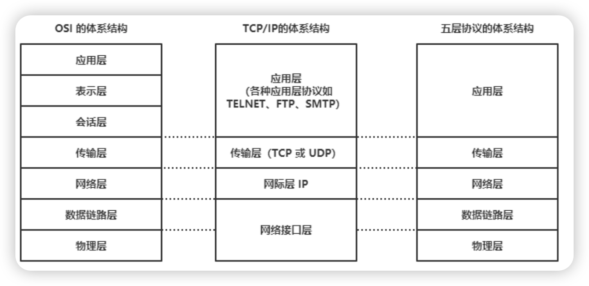
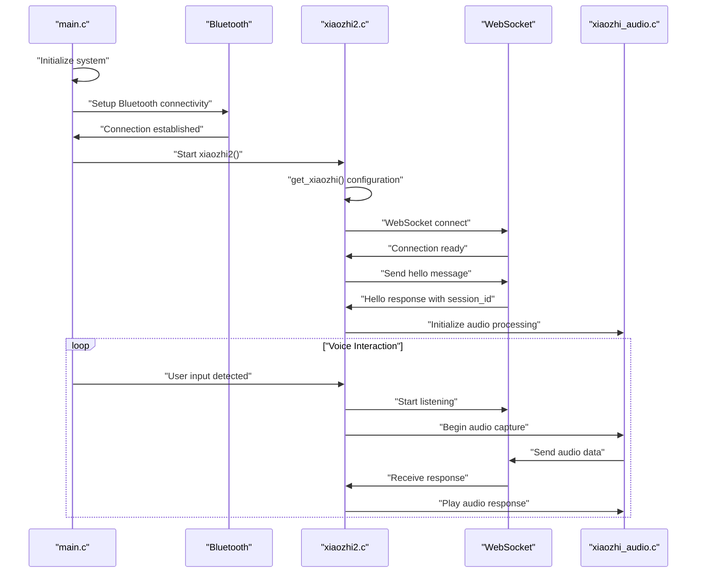
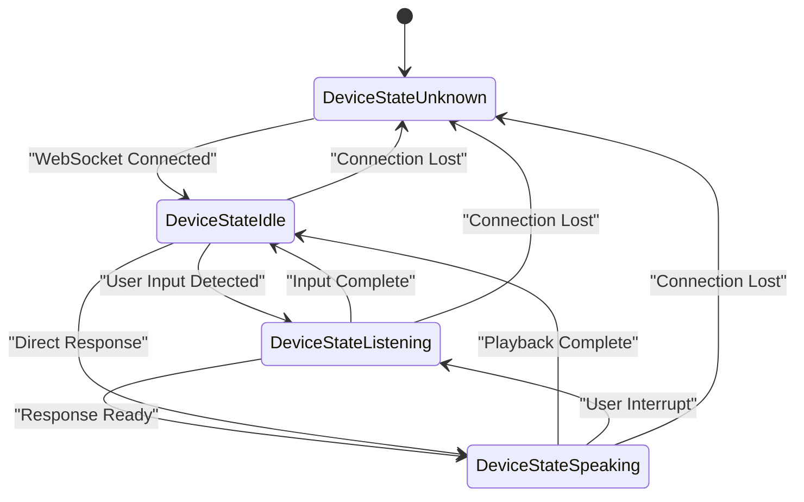

随着人工智能技术的快速发展，人们期望能在各类设备上实现智能化。虽然端侧设备的计算能力有限，但是通过云端的强大算力，我们也一样可以实现各类智能应用。xiaozhi就是在这样的背景下诞生的一个开源项目，旨在创造一个轻量的端侧AI语音助手。

xiaozhi-sf32则是xiaozhi在SF32系列芯片上的实现。SF32系列芯片是SiFli公司推出的一款高性能、低功耗的SoC芯片，具有丰富的外设接口和强大的处理能力，非常适合用于智能设备。与同类设备相比，SF32系列芯片在性能和功耗方面具有明显优势，特别是在功耗方面，SF32系列芯片的功耗仅为同类设备的1/10左右。

xiaozhi-sf32的设计目标是提供一个开源、可定制、易于使用的AI语音助手解决方案，支持多种硬件平台和应用场景。它不仅可以作为一个独立的语音助手使用，还可以与其他设备和服务进行集成，实现更丰富的功能。

## 网络连接

与其它物联网芯片相比，SF32系列芯片缺失了Wi-Fi外设。因此很多人也许都会很好奇是如何实现网络连接。SF32芯片支持双模蓝牙（BLE和BR/EDR），在此基础上我们就可以使用蓝牙PAN协议来实现网络连接。蓝牙PAN协议可以将手机的网络共享，从而让SF32也能实现互联网连接。

### 蓝牙 PAN

蓝牙 PAN（个人区域网）是一种基于蓝牙无线技术的网络规范，旨在让多台蓝牙设备在短距离（通常 ≤10 米）内，基于 IP 协议互联、共享网络资源或点对点通信。它通过封装以太网帧的方式，为手机、笔记本、平板、物联网设备等提供灵活、即插即用的网络连接能力。

蓝牙 1.1/1.2 版本开始支持网络封装（BNEP），并在 1.2 及以后的规范中正式定义 PAN 结构。

蓝牙 PAN 基于经典蓝牙（BR/EDR）协议栈，主要借助以下关键协议：

- SDP（Service Discovery Protocol）
用于设备间的服务发现，确定是否支持 PAN、角色类型等。
- BNEP（Bluetooth Network Encapsulation Protocol）
在蓝牙 L2CAP 之上，实现以太网帧的封装、拆封和传输。
- PPP/IPv4/IPv6
在 BNEP 之上，可运行 PPP 拨号或直接承载 IP 数据包，实现上层网络协议通信。

蓝牙 PAN 定义了三种设备角色，灵活应对不同网络需求：

- PAN User（PANU，客户端）

加入 PAN 网络的终端，如智能手机、笔记本、平板。
向 NAP 发起连接请求，获取 IP 地址和路由服务。

- Network Access Point（NAP，接入点）

类似路由器或热点，向其他 PANU 提供互联网或局域网接入。
通常内置于手机（蓝牙网络共享）、笔记本或专用网关中。

- Group Ad-hoc Network（GN，组网模式）

对等网络，多个设备相互连接而无中心节点。
适合临时文件传输、多人游戏等点对点协作场景。

### LwIP

现在我们可以通过PAN来连上网络了，但是对于一个完整应用来说，只是连上网络是远远不够的。我们还需要一个轻量级的网络协议栈来处理网络通信。LWIP（Lightweight IP）是一个开源的轻量级TCP/IP协议栈，专为资源受限的嵌入式系统设计，非常适合用于SF32系列芯片。

#### TCP/IP

让我们先来回忆下曾经学过的TCP/IP（Transmission Control Protocol / Internet Protocol）定义，它将网络通信分为四层（或五层）：

- 链路层：负责物理介质（以太网、Wi-Fi、串口等）上的帧传输。
- 网络层（IP）：负责分组（Packet）路由与转发，提供无连接的「尽力交付」服务。
- 传输层：
    - TCP（面向连接、可靠）
    - UDP（无连接、不保证可靠）
- 应用层：各种协议（HTTP、MQTT、WebSocket 等），直接为终端应用提供服务接口。

#### lwIP 协议栈

lwIP（lightweight IP）是一个开源的、面向嵌入式系统设计的轻量级 TCP/IP 协议栈。其目标是在极低的内存、CPU 资源下，实现对 TCP、UDP、ICMP、RAW API 等协议的支持。

lwIP 具有以下优点：

- 轻量级： lwIP 内核有自己的内存管理策略和数据包管理策略， 使得内核处理数据包的效率很高。另外， lwIP 高度可剪裁，一切不需要的功能都可以通过宏编译选项去掉。 lwIP 的流畅运行需要 40KB 的代码 ROM 和几十 KB 的RAM， 这让它非常适合用在内存资源受限的嵌入式设备中。
- 支持的协议较为完整。 几乎支持 TCP/IP 中所有常见的协议。
- 高度可移植。其源代码全部用 C 实现，用户可以很方便地实现跨处理器、跨编译器的移植。另外，它对内核中会使用到操作系统功能的地方进行了抽象，使用了一套自定义的 API，用户可以通过自己实现这些 API，从而实现跨操作系统的移植工作。
- 开源、免费，用户可以不用承担任何商业风险地使用它。

#### 应用层协议

我们在日常生活中接触到的网络协议大多属于应用层协议，例如HTTP、MQTT、WebSocket等。lwIP协议栈支持多种应用层协议，可以满足不同场景的需求。下面是几种常见的应用层协议介绍：

##### HTTP

HTTP（HyperText Transfer Protocol，超文本传输协议）是现代 Web 应用的基础协议，主要用于客户端（如浏览器）与服务器之间的数据通信。它是无状态的、基于请求-响应模式的协议，常用于网页、API 接口等场景。

##### MQTT

MQTT（Message Queuing Telemetry Transport）是一种轻量级的消息发布/订阅协议，专为低带宽、不可靠网络环境设计，广泛应用于物联网（IoT）领域。它通过 Broker 中转消息，终端设备只需与 Broker 建立连接即可收发数据。

##### WebSocket

WebSocket 是一种在单个 TCP 连接上进行全双工通信的协议，常用于需要实时、低延迟数据交互的场景（如在线聊天、实时游戏、物联网数据推送等）。与 HTTP 不同，WebSocket 连接一旦建立后可持续传输数据，避免了频繁的连接和关闭。

在xiaozhi项目中，我们选择了使用WebSocket作为主要的通信协议。WebSocket能够提供低延迟、实时的双向通信，非常适合用于语音助手这样的应用场景。同时，也是用到了HTTP来作为一些API的接口协议。

## 核心架构

xiaozhi由多个关键组件组成，这些组件协同工作以正常工作。

xiaozhi还维护有一个状态机来管理不同的状态和事件。

