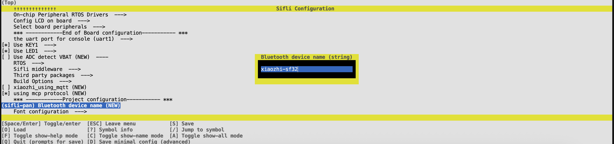
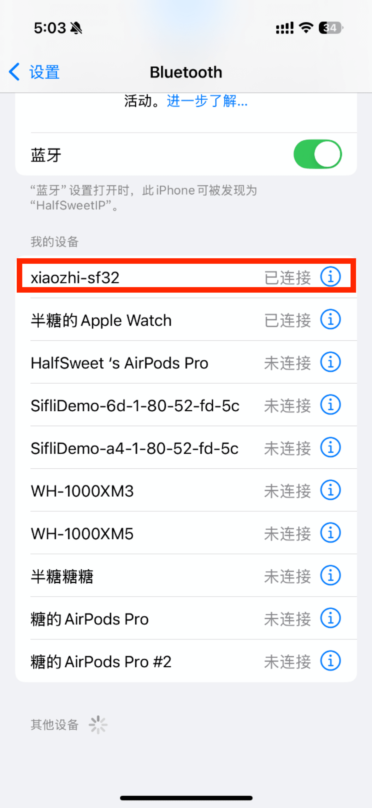
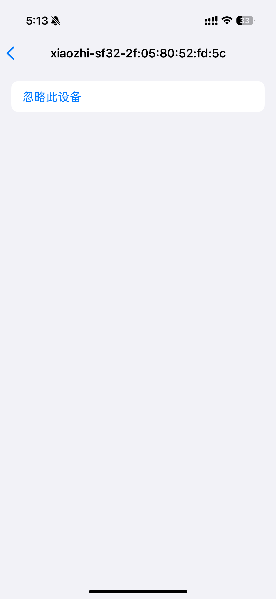

默认情况下，小智的蓝牙名称是`sifli-pan`。但是默认的名称有些太大众化了，并且存在多个设备的时候还可能会混淆，因此在本文档中我们将尝试修改。

## 静态名称

静态的含义就是每个设备的蓝牙名称都是固定的，不会随着设备的变化而变化。这样我们在menuconfig中即可更改

### 打开menuconfig

在终端中输入以下命令打开menuconfig：

```bash
scons --board=<board> --menuconfig
```

::: tip
其中`<board>`需要替换为你所使用的开发板型号，比如`sf32lb52-devkit-ulp`、`sf32lb52-devkit-lcd`或`sf32lb52-devkit-nano`。下同。
:::



### 修改蓝牙名称

打开之后，选择`Bluetooth device name`，然后输入你想要的名称，比如`xiaozhi-sf32`。

保存之后，重新编译下载即可



## 动态名称

### 添加MAC地址

为了避免多个设备名称相同导致的冲突，我们可以选择在蓝牙名称后面加上设备的MAC地址。这样每个设备的名称就会是唯一的。

要完成这个操作，只需要在menuconfig中开启`Apped the MAC address to the Bludetooth name`选项即可。

保存之后，重新编译下载即可。



### 自定义名称

如果你还是不满意，觉得都不能满足你的个性的话，那就需要修改代码了。修改方法也很简单，只需要修改`bt_interface_set_local_name`这个函数中的参数即可。这个函数在`main.c`中被调用。

一般来说这个文件是这样的：

```c
#ifdef BT_NAME_MAC_ENABLE
            char local_name[32];
            bd_addr_t addr;
            ble_get_public_address(&addr);
            sprintf(local_name, "%s-%02x:%02x:%02x:%02x:%02x:%02x",
                    BLUETOOTH_NAME, addr.addr[0], addr.addr[1], addr.addr[2],
                    addr.addr[3], addr.addr[4], addr.addr[5]);
#else
            const char *local_name = BLUETOOTH_NAME;
#endif
            bt_interface_set_local_name(strlen(local_name), (void *)local_name);
```

如果你希望设置成别的，那么只需要将函数的入参修改为对应的字符串即可。
