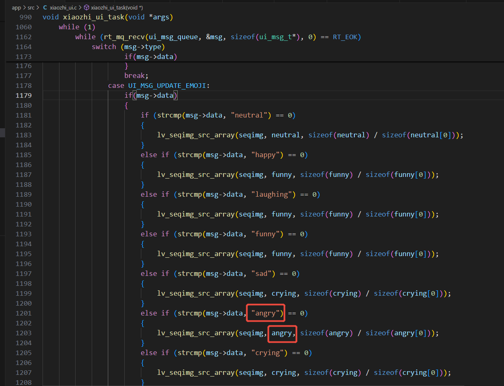

xiaozhi-sf32现已支持自定义动态图片，在`eZIP`的硬件加速解压缩引擎下，可以帮助我们快速地解压缩图片数据。并且压缩出来的图片都是无损的，这样就可以在不损失图片质量的前提下，节省存储空间，可尽情自定义添加动态图片，由于直接使用gif会有背景色的干扰，本动态图片的实现的思路是运用序列帧的方式实现。

## 素材预处理

### 准备要求

1. 一组有顺序的`.png`图片组，分辨率为200x200像素
2. 找到一个你想自定义播放的gif素材，通过在线工具`https://ezgif.com/optimize`将gif切割成一组png图片组，图片的命名顺序即是播放顺序，注意图片命名不可有空格
3. gif素材推荐60帧数，200-400kb左右，此参数下切割后的图片组大小适中

### 示例素材

为了便于复现结果，我们提供了一个[示例素材](./image/angry.gif)。现在就让我们来尝试一步步操作。

## 准备素材步骤

### 1. 通过在线工具优化GIF

使用在线工具将gif素材优化成合适大小，然后再进一步将gif图切割成png素材。

#### 优化删减帧数

可选择优化删减帧数，对gif文件大小进行瘦身：

#### 查看优化结果

优化后可查看优化后的gif文件数据，选择是否进一步优化：

#### 切割GIF为PNG序列

数据大小及帧率优化合适之后可以选择将gif分割成png图片组，以png格式输出：

### 2. 整理图片素材

将切割后的PNG图片放置在一个文件夹内，图片命名顺序即播放顺序。推荐将新增自定义图片覆盖原始图片组，以防止额外的空间消耗：

## 确保素材被正确使用

新准备的素材可能帧数和原始素材帧数不一样，我们需要确认素材是否被正确使用。

### 1. 确保图片资源文件夹被加入ezip编译

素材的编译引用需要在`app/asset/SConscript.py`下确认，现内容是默认图片组的引用，可以根据自定义的文件夹加上一条：

### 2. 头文件中添加声明

图片被ezip压缩之后成为数组变量，需要在`xiaozhi_ui.h`中确认或添加外部变量的声明，并且将图片放置数组内。每一张图片都是一个带有序号的变量名，然后我们按顺序放在一个数组内：

### 3. 在相关处理小智情绪的代码区应用

> 注意：编译后显示类似over+数字的报错表示asset整体素材已经超出空间大小。

## 最终效果

最后我们可以看到效果：

