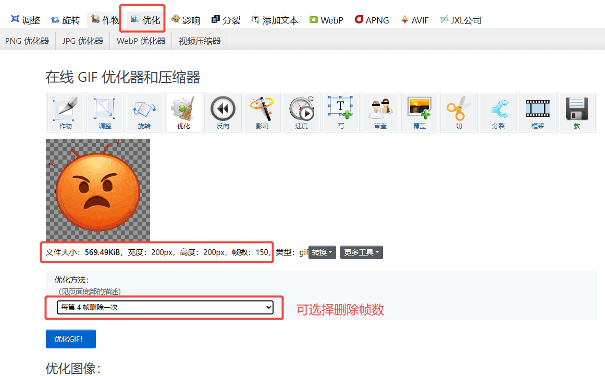
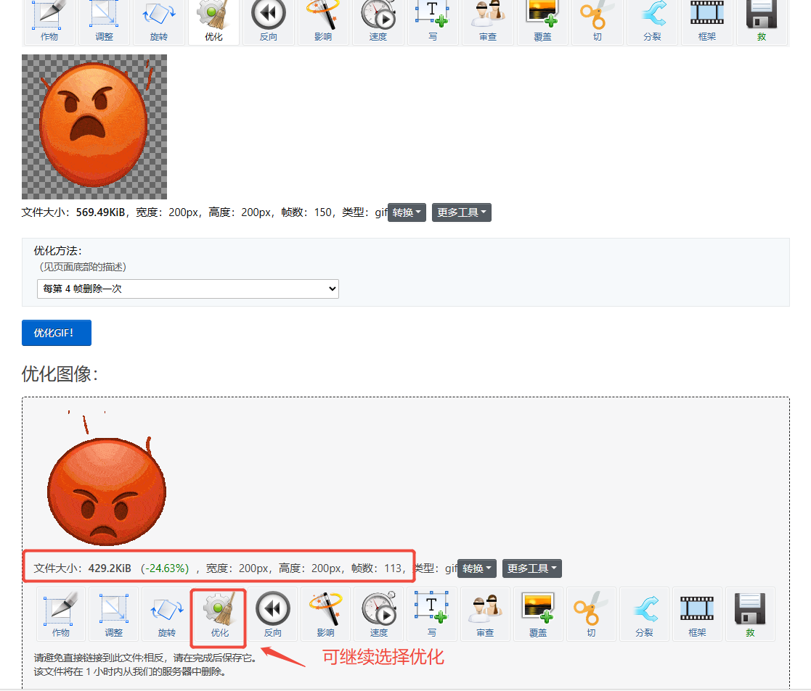
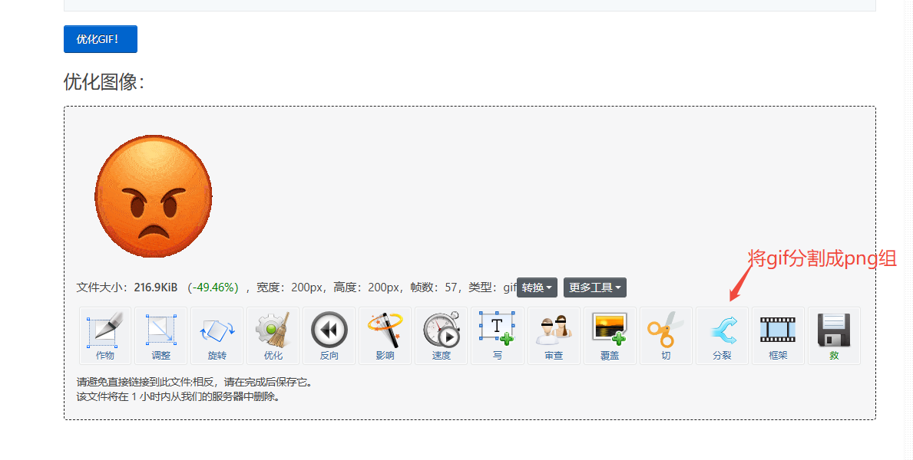
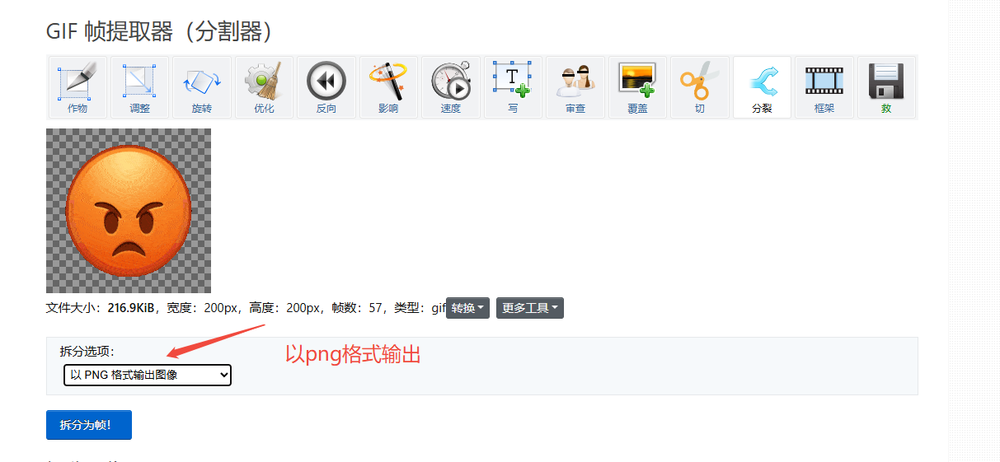
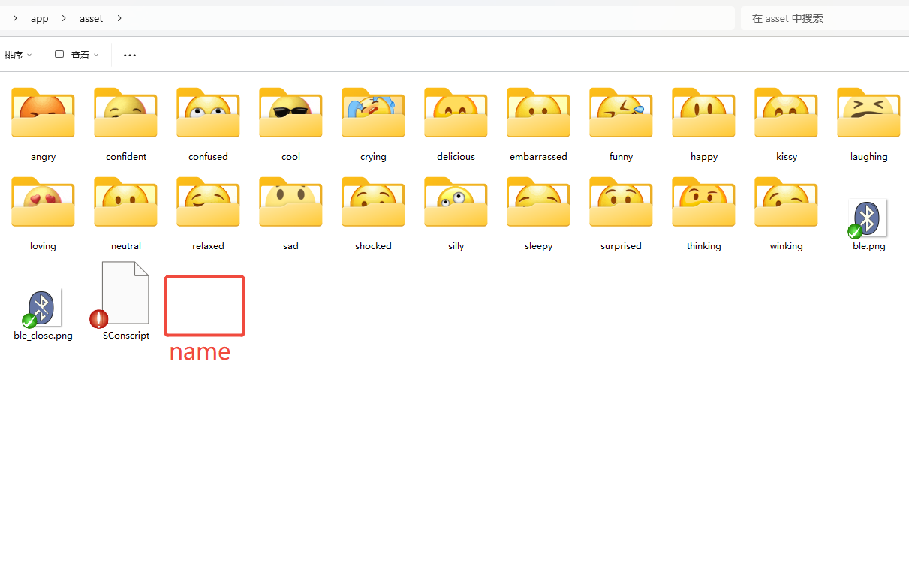
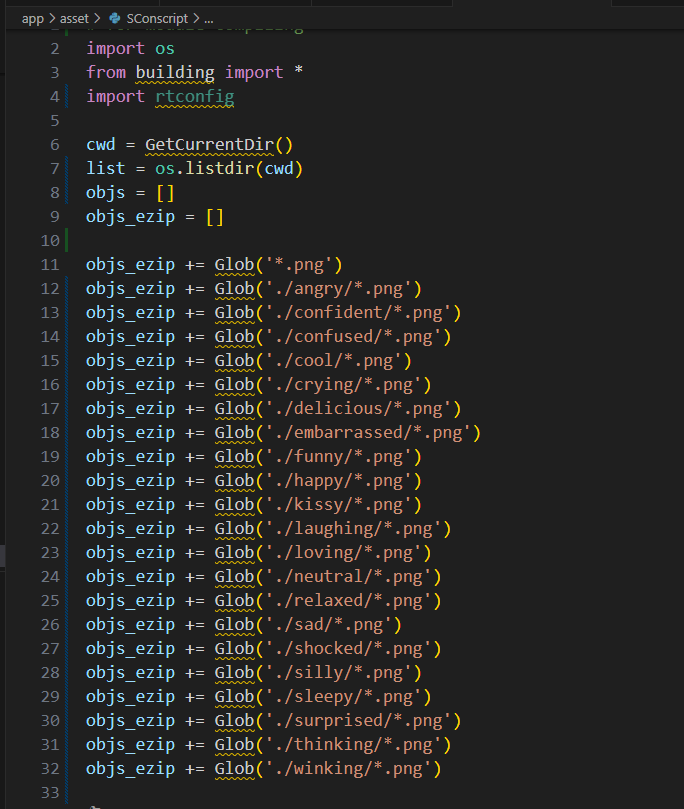
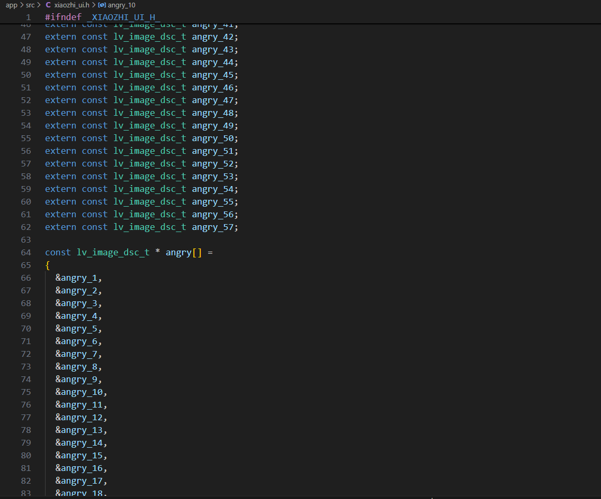
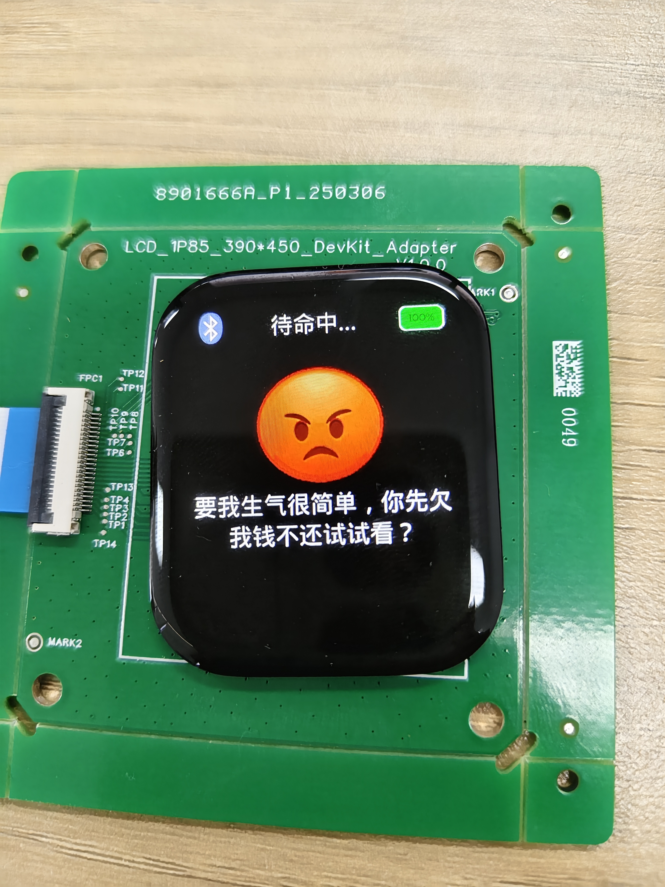

xiaozhi-sf32现已支持自定义动态图片，在`eZIP`的硬件加速解压缩引擎下，可以帮助我们快速地解压缩图片数据。并且压缩出来的图片都是无损的，这样就可以在不损失图片质量的前提下，节省存储空间，现默认图片组高达21组，可尽情自定义添加动态图片，由于直接使用gif会有背景色的干扰，本动态图片的实现的思路是运用序列帧的方式实现。

## 素材先处理

1. 一组有顺序的`.png`图片组，分辨率为200x200像素
2. 找到一个你想自定义播放的gif素材，通过在线工具`https://ezgif.com/optimize`将gif切割成一组png图片组，图片的命名顺序即是播放顺序，注意图片命名不可有空格。
3. gif素材推荐60帧数，200-400kb左右，此参数下切割后的图片组大小适。

为了便于复现结果，我们提供了一个[示例素材](./image/angry.gif)。现在就让我们来尝试一步步操作。

## 准备素材
### 通过在线工具将gif素材优化成合适大小，然后再进一步将gif图切割成png素材
### 在线工具的简单使用：
#### 可选择优化删减帧数，对gif文件大小进行瘦身

#### 优化后可查看优化后的gif文件数据，选择是否进一步优化

#### 数据大小及帧率优化合适之后可以选择将gif分割成png图片组,以png格式输出

#### 放置在一个文件夹内，图片命名顺序即播放顺序，推荐将新增自定义图片覆盖原始图片组，以防止额外的空间消耗

## 确保素材被使用
### 新准备的素材可能帧数和原始素材帧数不一样，我们需要确认素材是否被使用：
#### 素材的编译引用需要在app/asset/SConscript.py下确认，现内容是默认图片组的引用

#### 另外需要在xiaozhi_ui.h中确认或添加外部变量的声明，并且将图片放置数组内

* 注意编译后显示类似over+数字的报错表示asset整体素材已经超出空间大小。
#### 最后我们可以看到效果。

