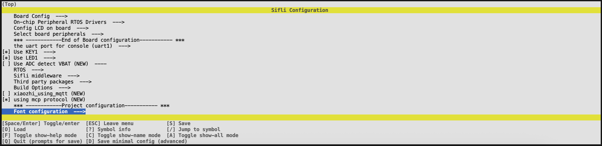
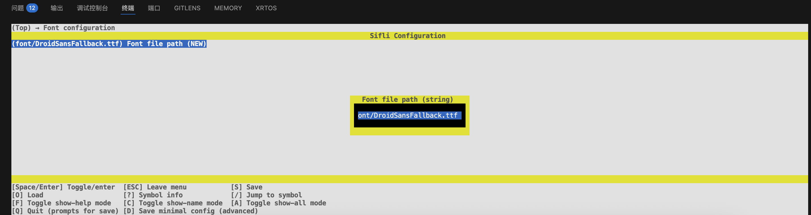
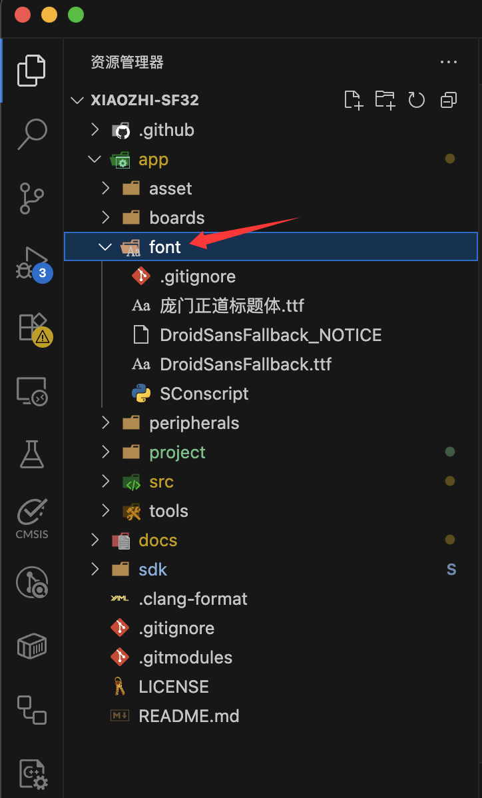
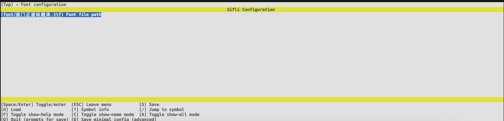

原生的字体太丑了，想要换个好看的字体？没问题！xiaozhi-sf32支持自定义字体，你可以使用自己喜欢的字体来替换原有的字体。在最新的版本中，我们提供了更加灵活的字体配置选项。

## 打开menuconfig

在终端中输入以下命令打开menuconfig：

```bash
scons --board=<board> --menuconfig
```

::: tip
其中``<board>``需要替换为你所使用的开发板型号，比如`SF32LB52-DevKit-ULP`、`SF32LB52-DevKit-LCD`或`SF32LB52-DevKit-Nano`。下同。
:::



打开`Font configuration`菜单后，你可以看到以下选项：



## 添加字体路径

`Font file path`选项即是你要添加的字体文件路径。需要注意的是，如果采用相对路径的写法，比如`font/myfont.ttf`，那么需要你将字体文件放在`app/src/font/`目录下。或者也可以采取绝对路径的写法，比如`/Users/sifli/Documents/myfont.ttf`。



在这里，我们选择另一个自带的字体文件`庞门正道标题体.ttf`



保存之后，重新编译烧录，即可看到效果。


