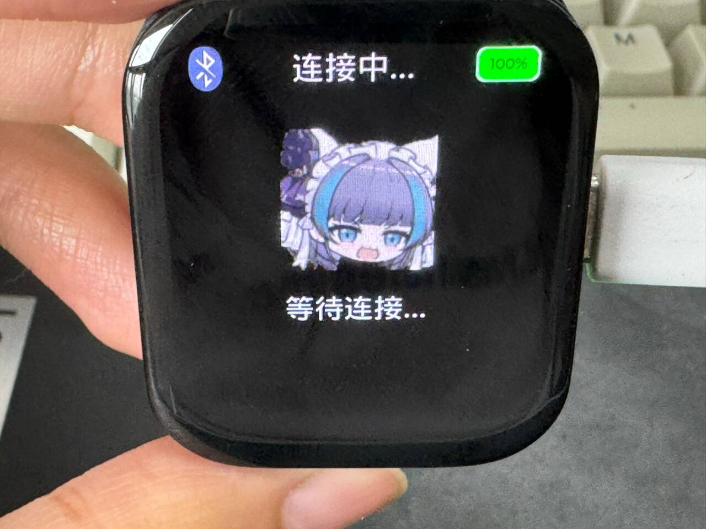

经过一段时间的使用，大家不难发现小智界面中存在很多图片，例如不同的状态下的图标都是静态的。但是如果感觉太丑了，或者是想要换个好看的图片，xiaozhi-sf32也支持自定义静态图片。

我们日常接触到的图片格式有很多种，比如PNG、JPG等，但是对于嵌入式系统来说，这样的图片格式解析起来并不是一件容易的事。不仅代码繁琐，而且还会占用不小的内存空间。幸运的是，SF32系列芯片都有一个名为`eZIP`的硬件加速解压缩引擎，它可以帮助我们快速地解压缩图片数据。并且压缩出来的图片都是无损的，这样就可以在不损失图片质量的前提下，节省存储空间。并且eZIP还可以和思澈自研的`ePicasso`高效 2.5D GPU配合使用，来实现更高效的图形渲染。

说了这么多，大家会不会感觉eZIP使用起来会很麻烦呢。恰恰相反，SiFli-SDK中其实做了很多封装工作，我们只需要修改对应的资源文件就可以了。

## 素材先处理

eZIP对素材有一定要求，必须满足下面几个条件

1. 图片格式为PNG，后缀名为`.png`
2. 分辨率为200x200像素

为了便于复现结果，我们提供了一个。现在就让我们来尝试一步步操作。

## 替换素材

我们将示例素材替换掉`app/asset`中对应的图片文件，删掉自动生成的中间目录。如果你是`sf32lb52-lchspi-ulp`开发板的话，那就删掉`app/project/build_sf32lb52-lchspi-ulp_hcpu/asset`目录下的所有文件。

删掉之后，重新编译下载即可。

最后我们可以看到效果。

