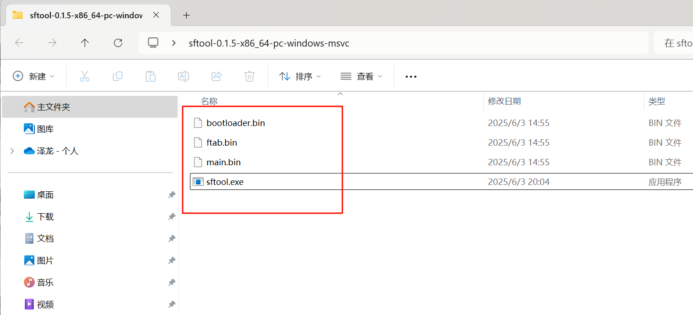
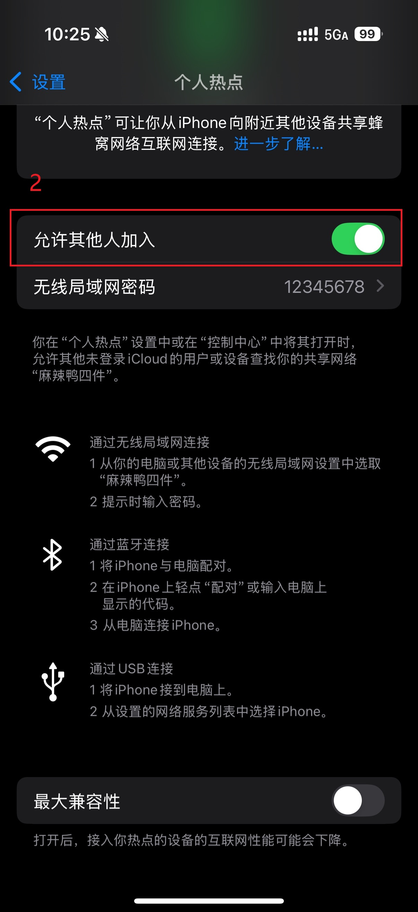
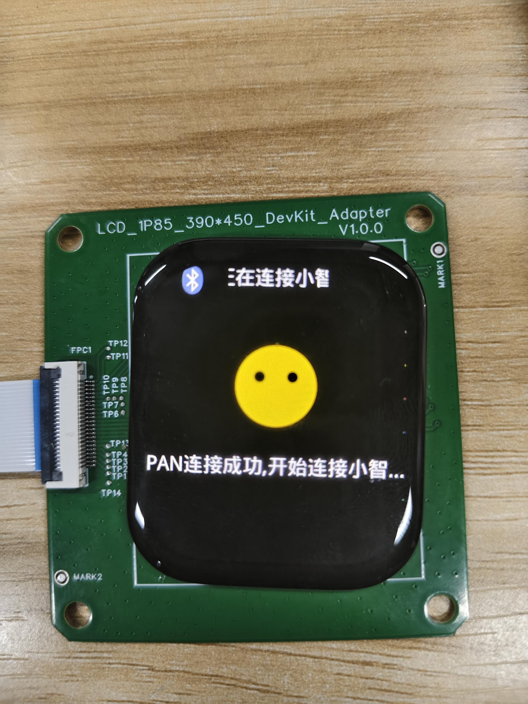

这里是xiaozhi-sf32的快速入门指南。
## 硬件支持列表

- [SF32LB52-DevKit-ULP（黄山派）](SF32LB52-DevKit-ULP/README.md)
- [SF32LB52-DevKit-LCD开发板](SF32LB52-DevKit-LCD/README.md)
- [SF32LB52-DevKit-Nano开发板](SF32LB52-DevKit-Nano/README.md)
## 前置准备

在开始之前，我们需要进行一些前置工具，请确保完成以下的步骤：

1. [sftool](sftool.md): 用于SF32系列SoC芯片的烧录

2. 下载固件：
开发板的固件位于 <https://github.com/78/xiaozhi-sf32/releases>，我们下载最新release版本的压缩包。需要注意的是，我们一共需要`bootloader.bin`、`ftab.bin`、和`main.bin`这三个文件。
建议先下载sftool工具，下载完成后将这三个文件放在sftool文件夹中

 

3. 开发板对应固件：
SF32LB52-DevKit-ULP（黄山派）: SF32LB52-DevKit-ULP.zip
SF32LB52-DevKit-LCD: SF32LB52-DevKit-LCD.zip
SF32LB52-DevKit-Nano: SF32LB52-DevKit-Nano.zip

## 烧录固件

使用[sftool工具](../sftool.md)烧录固件，打开终端之后输入如下命令：

```powershell
./sftool.exe -p COM3 -c SF32LB52 write_flash bootloader.bin@0x12010000 main.bin@0x12020000 ftab.bin@0x12000000
```

::: tip

其中`COM3`是你连接开发板的串口号，可能会有所不同，请根据实际情况修改。`bootloader.bin`、`main.bin`、和`ftab.bin`是你下载的固件文件名，建议使用绝对路径引用，如果路径中出现中文或者空格请用`"`将路径括起来。

:::

没有意外的话，烧录完成之后会自动重启运行，屏幕应该被点亮。

## 蓝牙使用注意事项

在连接板子设备之前，请打开手机的蓝牙网络共享功能！！！

### Android蓝牙使用注意事项

以下是Android手机的蓝牙设置界面，通过打开个人热点共享中的蓝牙共享网络功能。

 


### iOS蓝牙使用注意事项

iOS同样需要打开蓝牙共享网络功能，以下是参考步骤





⚠ 注意 如果iOS在蓝牙列表未看见sifli-pan 设备，请尝试重启手机。

## 开始使用

正确烧录固件后，开发板初始化界面如下:

{width=50%}

### 激活设备

烧录固件之后，确保蓝牙共享网络已打开，这时，手机就可以连接蓝牙 sifli-pan 设备了。 以下是Android手机连接状态示例图: 

{width=30%}

⚠ 注意：一般情况下，Android连接成功后，连接的蓝牙设备会显示正在向设备共享网络（iOS不会显示）,我们可以以此确定是否成功开启蓝牙网络共享

⚠  连接上sifli-pan设备后，开发板会有连接画面提示，此时按下对话按键（参考对应硬件支持查看对话按键），xiaozhi则会提示需要登录到控制面板，填设备码。

| {width=50%} | {width=50%}  |
|-------------------------------|-------------------------------|

| {width=50%} | {width=50%}|
|-------------------------------|-------------------------------|

⚠  这个时候，打开浏览器，输入网址：<https://xiaozhi.me>。浏览器用手机或者电脑都可以。 进入小智 AI 的网页后，点击控制台，用手机号登录。

新建智能体填写，最后添加设备码。

可以这个时候拔掉开发板上的数据线再接入就可以正常使用了。


## 界面提示含义
### 出现下方UI提示均是pan断开的情况

| {width=50%} | {width=50%} | {width=50%} |
| --- | --- | --- |
### 异常情况：
1. 对应手机的显示可能是未打开蓝牙共享直接连接sifli-pan设备
2. 蓝牙共享网络关闭
3. 蓝牙已断开

解决方案：打开蓝牙共享网络重新连接设备

下图为蓝牙连接成功但未开启蓝牙共享网络：

{width=30%}

## 唤醒 & 重连

### 唤醒

长时间未对话小智会进入休眠，此时需要按下唤醒键进行唤醒（参考对应硬件支持查看唤醒键）

{width=30%}

### 重连

支持重连操作：若无主动删除手机匹配列表下的sifli-pan设备，当按下唤醒键也可进行蓝牙重连（参考对应硬件支持查看唤醒键）

| {width=30%} | {width=30%}

