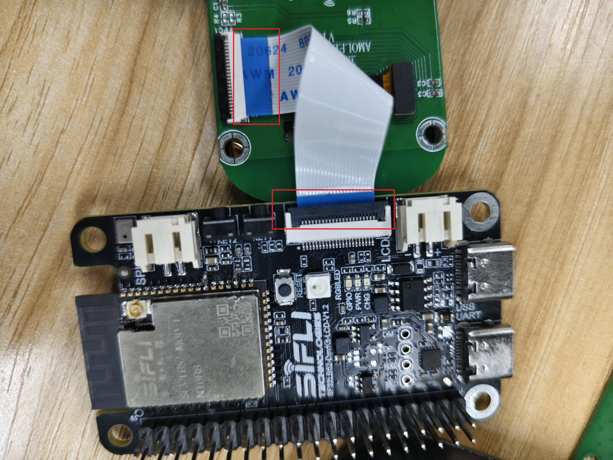
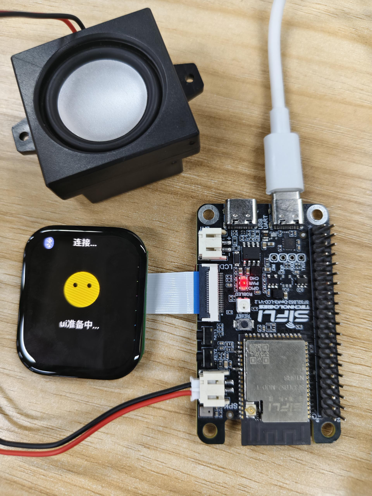

本文档介绍SF32LB52-DevKit-LCD使用小智所需硬件连接。

## 硬件准备

### 1. 连接屏幕
准备一块390*450 AMOLED屏 和 FPC转接线，接时注意FPC转接线的面板方向，参考下图所示。

FPC转接线双面展示
| {width=50%} | {width=50%} |
| --- | --- |

### 2. 连接喇叭
应该将喇叭连接到开发板的`SPK`接口上，SF32LB52-DevKit-LCD开发板支持8Ω和4Ω的喇叭，建议使用4Ω的喇叭，音量更大。

### 3. 最终硬件连接

## 快速入门
硬件连接完成即可快速入门，请查看：[快速入门](../README.md)。