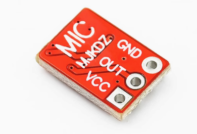
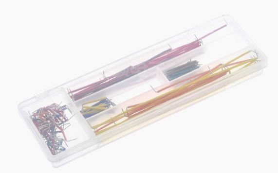
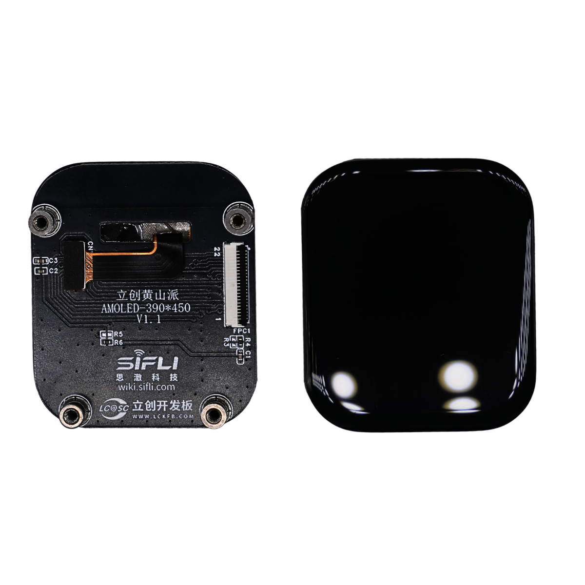
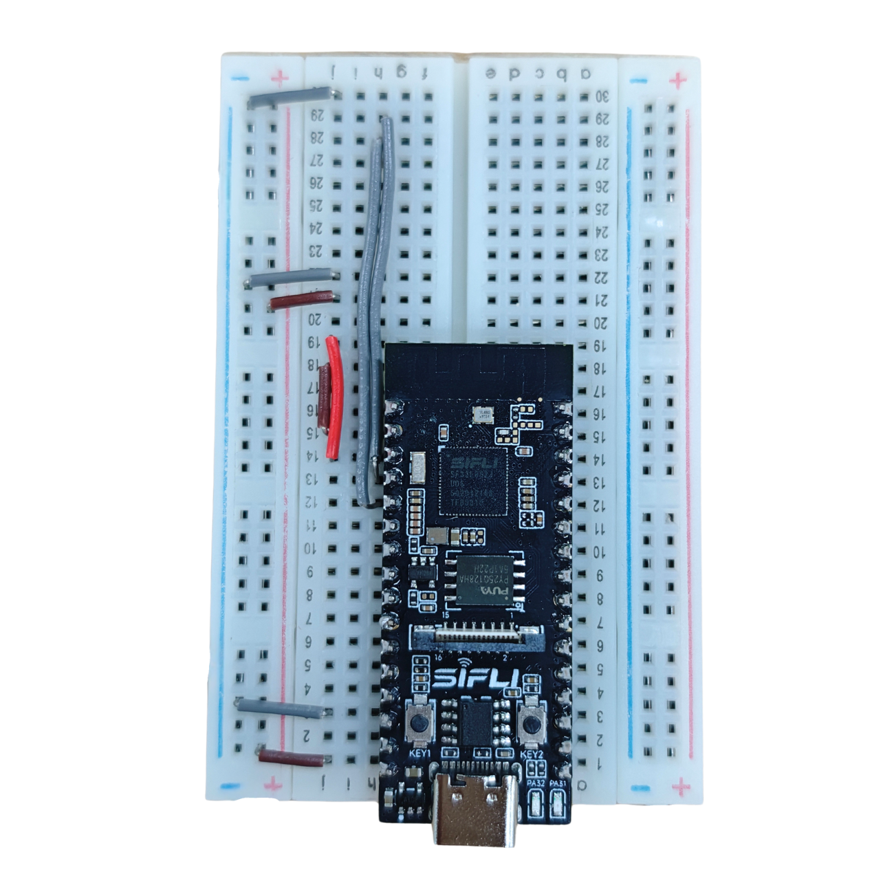
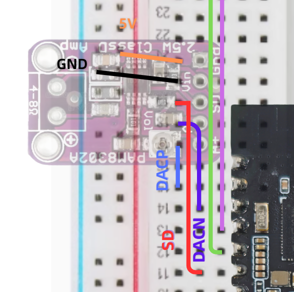
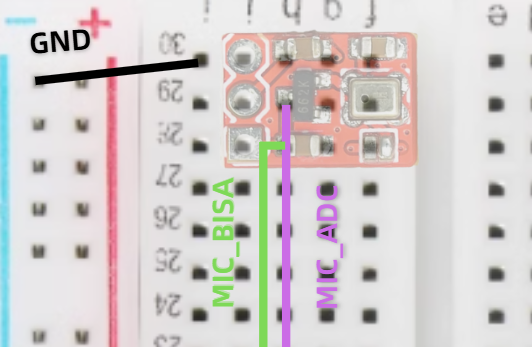

本文档将介绍如何在SF32LB52-DevKit-Nano上快速入门。

{width=50%}

## 前置准备

### 1.安装烧录工具：
[sftool工具](../sftool.md)。

### 2.下载固件：
SF32LB52-DevKit-Nano开发板的固件位于 <https://github.com/78/xiaozhi-sf32/releases>，我们下载最新版本。需要注意的是，我们一共需要下载`bootloader.bin`、`ftab.bin`、和`main.bin`这三个文件。


## 硬件准备工作

1. ### DIY 所需硬件

- 开发板：SF32LB52-DevKit-Nano（R16N16版本）
- 模拟麦克风：MEMS麦克风模块 https://item.taobao.com/item.htm?id=595237371680
- 模拟功放：PAM8302 https://item.taobao.com/item.htm?id=535743493142
- 腔体喇叭：8Ω 2~3W https://item.taobao.com/item.htm?id=895176389650
- 导线：跳线一盒 https://item.taobao.com/item.htm?id=39961676503
- 400 孔面包板 1 块 https://item.taobao.com/item.htm?id=39828824454
- 390*450 AMOLED屏 和 FPC转接线

除此之外，你可能还需要用到万用表，电烙铁套件，钳子三件套，Type-C数据线，用于烧录固件的PC。

#### 1.1 开发板：SF32LB52-DevKit-Nano（R16N16版本）

SF32LB52-DevKit-Nano（R16N16版本）是基于思澈科技SF32LB52JUD6芯片的开发板，拥有16MB的高速PSRAM和16MB的NOR Flash，超大资源配置为未来小智功能升级留够空间。SF32LB52JUD6芯片拥有240MHZ的M33大核和24MHZ的小核，大核负责逻辑处理小核负责蓝牙通信，性能与功耗兼备，小智连接功耗低至3ma；芯片集成自研2.5GPU深入适配lvgl可流畅驱动480*480分辨率以下的各种屏幕；芯片集成codec，支持24位的ADC音频采样和24位的DAC输出，仅需简单的外部连接mic和功放即可实现高品质音频输入输出。开发板板载尺寸仅有21mm*51mm，板边采用邮票孔设计，方便焊接和贴装。开发板采用USB Type-C接口，一个口解决供电和烧录调试，无需其他调试器；板载FPC连接座可直插屏幕，方便接线。


#### 1.2 模拟麦克风：MEMS麦克风模块



因为芯片集成了codec，所以可以直接连接模拟麦克风或硅麦克风，简单接线就能实现高保真的音频输入。

模拟麦克风通过振膜振动产生模拟电信号，需外接放大电路；硅麦克风（MEMS）采用半导体工艺，直接将声波转化为数字信号。硅麦克风优势显著：体积微型化，功耗更低，抗电磁干扰能力强，易于集成于智能设备与物联网终端，且具备高稳定性和批量生产成本优势，所以我们这次选择了硅麦克风（MEMS）

#### 1.3 模拟功放：PAM8302


我们选择带Shutdown（关机功能）的音频功放模组，通过芯片软件控制功放的开关，可以在不播放音频的时候关闭功放进行省电，对于我们选择的这款功放，运行和Shutdown功耗相差8ma左右。并且模块集成了一个旋钮电阻，可以调节音量大小，更方便的适配各种喇叭。

#### 1.4 腔体喇叭：8Ω 2~3W

选4-8Ω的喇叭都可以，建议选择8Ω的


选的功放上面不带座子，可以自行选择焊接功放的座子https://item.taobao.com/item.htm?id=538071892729 也可以选择把喇叭的的端子剪断，直接焊接在板子上。

#### 1.5 导线：跳线一盒 



建议用这种跳线，电路连接以后看着会比较清爽

#### 1.6 400 孔面包板

如果没有面包板，我们在开发板上接的电子元件越来越多后，很容易就会乱成一团糟。


我们开发板尺寸21mm*51mm，排针距离为17.78，正好是2.54的7倍，因此可以直接插在一块面包板上使用，所以我们只需要购买一块面包板即可

面包板基础知识：面包板是分区块的，中间两个区块相同数字横向的每行是连通的（中间隔断除外），正负红蓝线是竖向每列连通的（如有隔断除外）。

#### 1.8 390*450 AMOLED屏 和 FPC转接线



AMOLED屏幕具备高对比度与鲜艳色彩，黑色显示纯正且节能，因像素独立发光特性可降低深色画面耗电量。目前主流的手机手表等都已经采用AMOLED屏幕。

我们选择的屏幕尺寸为1.85寸，分辨率为390*450，像素密度PPI为322，人的眼睛在手持设备上的分辨率为300PP左右，只有大于300PPI才感受不到像素颗粒。

屏幕采用QSPI接口，可以拥有更大的传输带宽，提高屏幕刷新率，保证界面的流畅。

1. ### 接线方案

#### 2.1 整体接线

整体接线示意图如下


以此视图为正面，所有模块的排针都在pcb的背面进行焊接，然后插到面包板上

#### 2.2 引脚定义


SF32LB52-DevKit-Nano开发板的引脚功能定义如上图所示，我们主要用mic和dac相关引脚，具体接线定义如下表

| SF32LB52-DevKit-Nano | MEMS麦克风  | 功能       |
| -------------------- | ----------- | ---------- |
| MIC_BIAS             | VCC         | 麦克风供电 |
| MIC_ADC              | OUT         | 麦克风输出 |
| GND                  | GND         | 电源地     |
|                      | PAM8302功放 |            |
| DACP                 | A+          | 音频输入正 |
| DACN                 | A-          | 音频输入负 |
| PA30                 | SD          | 功放开关   |
| 5V                   | Vin         | 电源正     |
| GND                  | Gnd         | 电源地     |

更简单直白的接线方式是，我们观察面包板可以看到，面包板上对横竖分别用字母a到j和数字1到30表示，最外层两列是+和-。那么接下来我们就直接用坐标的方式来描述接线方法，只需要用导线将两个点连接起来即可



| j1                       | +    |                                                  |
| ------------------------ | ---- | ------------------------------------------------ |
| j3                       | -    |                                                  |
| i11                      | j19  |                                                  |
| i14                      | j18  |                                                  |
| j15                      | j17  |                                                  |
| j20                      | -    |                                                  |
| j21                      | +    |                                                  |
| h12                      | h28  |                                                  |
| h13                      | h29  |                                                  |
| j30                      | -    |                                                  |
| MEMS麦克风vcc            | i28  | 可以直插排针无需导线注意模块方向即可             |
| MEMS麦克风out            | i29  |                                                  |
| MEMS麦克风gnd            | i30  |                                                  |
| PAM8302功放A+            | i17  | 可以直插排针无需导线注意模块方向即可             |
| PAM8302功放A-            | i18  |                                                  |
| PAM8302功放SD            | i19  |                                                  |
| PAM8302功放Vin           | i20  |                                                  |
| PAM8302功放Gnd           | i21  |                                                  |
| SF32LB52-DevKit-Nano 5V  | e1   | 只要确定好方向和两个关键引脚的位置，直接插上就行 |
| SF32LB52-DevKit-Nano GND | b1   |                                                  |

#### 2.3 PAM8302功放接线



#### 2.4 MEMS麦克风接线



#### 2.5 实物接线

未插模块的样子


插好模块的样子


#### 2.6 连接屏幕

先向上拉动FPC连接器，将FPC排线按照如图方向，金手指朝向芯片一侧插入连接器，然后向下推动连接器固定


翻开屏幕FPC连接器外侧的卡扣，将排线从内侧按如图方向插入连接器，然后向下按动连接器外侧卡扣扣紧


至此，所有硬件就连接完成了，最后应该是这样的


## 烧录固件

使用[sftool工具](../sftool.md)烧录固件，打开终端之后输入如下命令：

```powershell
sftool.exe -p COM3 -c SF32LB52 write_flash bootloader.bin@0x12010000 main.bin@0x12020000 ftab.bin@0x12000000
```

::: tip

其中`COM3`是你连接SF32LB52-DevKit-Nano开发板的串口号，可能会有所不同，请根据实际情况修改。`bootloader.bin`、`main.bin`、和`ftab.bin`是你下载的固件文件名，建议使用绝对路径引用，如果路径中出现中文或者空格请用`"`将路径括起来。

:::

没有意外的话，烧录完成之后会自动重启运行，屏幕应该被点亮。

## 蓝牙使用注意事项

在连接板子设备之前，请打开手机的蓝牙网络共享功能！！！

### Android蓝牙使用注意事项

以下是Android手机的蓝牙设置界面，通过打开个人热点共享中的蓝牙共享网络功能。


### iOS蓝牙使用注意事项

iOS同样需要打开蓝牙共享网络功能，以下是参考步骤

 


⚠ 注意 如果iOS在蓝牙列表未看见sifli-pan 设备，请尝试重启手机。

## 开始使用

正确烧录固件后，开发板初始化界面如下:

{width=50%}

### 激活设备

烧录固件之后，确保蓝牙共享网络已打开，这时，手机就可以连接蓝牙 sifli-pan 设备了。 以下是Android手机连接状态示例图: 

{width=30%}

⚠ 注意：一般情况下，Android连接成功后，连接的蓝牙设备会显示正在向设备共享网络（iOS不会显示）,我们可以以此确定是否成功开启蓝牙网络共享

⚠  连接上sifli-pan设备后，开发板会有连接画面提示，此时按下对话按键(KEY2)，xiaozhi则会提示需要登录到控制面板，填设备码。

| {width=50%} | {width=50%}  |
|-------------------------------|-------------------------------|

| {width=50%} | {width=50%}|
|-------------------------------|-------------------------------|

⚠  这个时候，打开浏览器，输入网址：<https://xiaozhi.me>。浏览器用手机或者电脑都可以。 进入小智 AI 的网页后，点击控制台，用手机号登录。

新建智能体填写，最后添加设备码。

可以这个时候拔掉开发板上的数据线再接入就可以正常使用了。

| 


## 界面提示含义
### 出现下方UI提示均是pan断开的情况

| {width=50%} | {width=50%} | {width=50%} |
| --- | --- | --- |
### 异常情况：
1. 对应手机的显示可能是未打开蓝牙共享直接连接sifli-pan设备
2. 蓝牙共享网络关闭
3. 蓝牙已断开

解决方案：打开蓝牙共享网络重新连接设备

下图为蓝牙连接成功但未开启蓝牙共享网络：

{width=30%}

## 唤醒 & 重连

### 唤醒

长时间未对话小智会进入休眠，此时需要按下`KEY1`进行唤醒

{width=30%}

### 重连

支持重连操作：若无主动删除手机匹配列表下的sifli-pan设备，当按下`KEY1`也可进行蓝牙重连

| {width=30%} | {width=30%}
