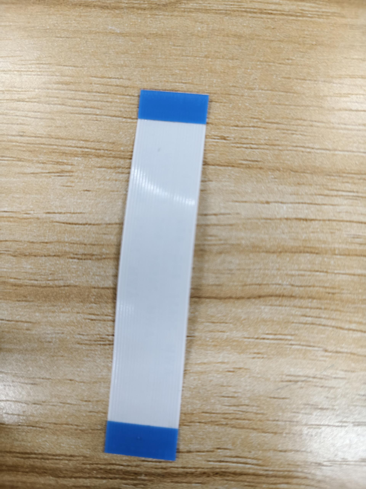
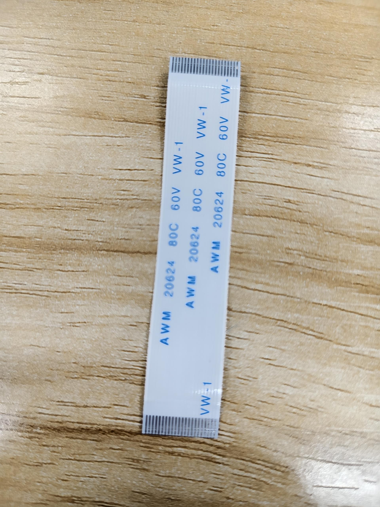

本文档将介绍如何在黄山派上快速入门。

## 硬件准备

### 1. 短接引脚

首先需要短接开发板的三对引脚，如图，这三对引脚是用来测量功耗的跳线，正常使用时需要将其短接。

{width=50%}

### 2. 连接喇叭

应该将喇叭连接到开发板的`SPK`接口上，黄山派支持8Ω和4Ω的喇叭，建议使用4Ω的喇叭，音量更大。

### 3.连接屏幕
准备一块390*450 AMOLED屏 和 FPC转接线，连接时注意FPC转接线的面板方向，参考下图所示。

FPC转接线双面展示
| {width=50%} | {width=50%} |
| --- | --- |

### 4.最终硬件连接

## 快速入门
硬件连接完成即可快速入门，请查看：[快速入门](../README.md)。
