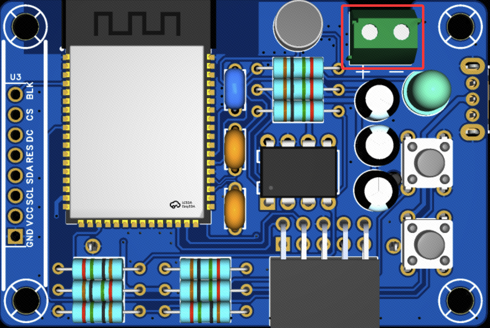

本文档将介绍如何在小汤圆直插版（立创训练营）上快速入门。

## 硬件准备

### 前置准备

因训练营中每位同学的设计都有可能不同，在此仅介绍参考设计的硬件，有改动的同学可以进行参考并针对自己的板子进行相关调整。

1. 准备一个 [立创商城 CH340X 串口模块](https://item.szlcsc.com/51679391.html?fromZone=s_s__%2522CH340X%2522&spm=sc.gbn.xh2.zy.t___sc.hm.hd.ss&lcsc_vid=QVhbAlYAFlcKVQIAFQBcBFNSElNbUgFTTlNXXgZVTwIxVlNTRlVbV1dUQ1BXVDtW)
2. 准备一个 CR123A 电池，需要注意在后续的下载过程中，电池的电量需要保持充足。因为该板子没有其他供电路径，串口模块无法供电！！

## 连接喇叭

应该将喇叭连接到板子的喇叭连接器上，注意该板子的功放最大输出功率仅有 1W，建议使用 8Ω的喇叭。

### 连接屏幕

准备一块 [1.69寸TFT屏幕](https://item.taobao.com/item.htm?id=694205959541)。插在屏幕排目上即可。

## 下载程序

硬件连接完成即可开始下载固件，请查看：[快速入门](../README.md)。
