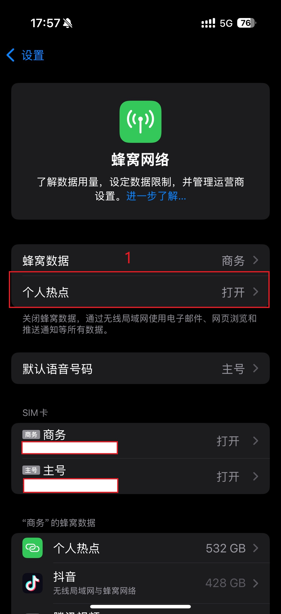
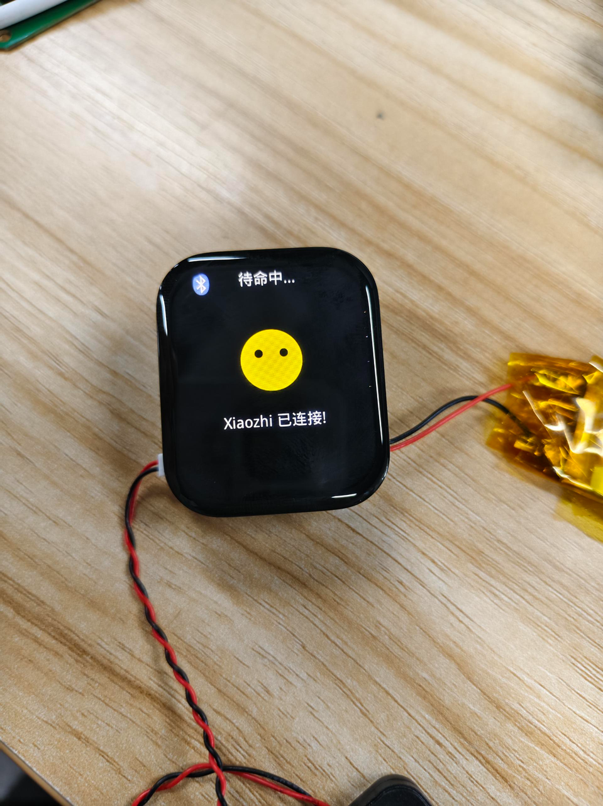
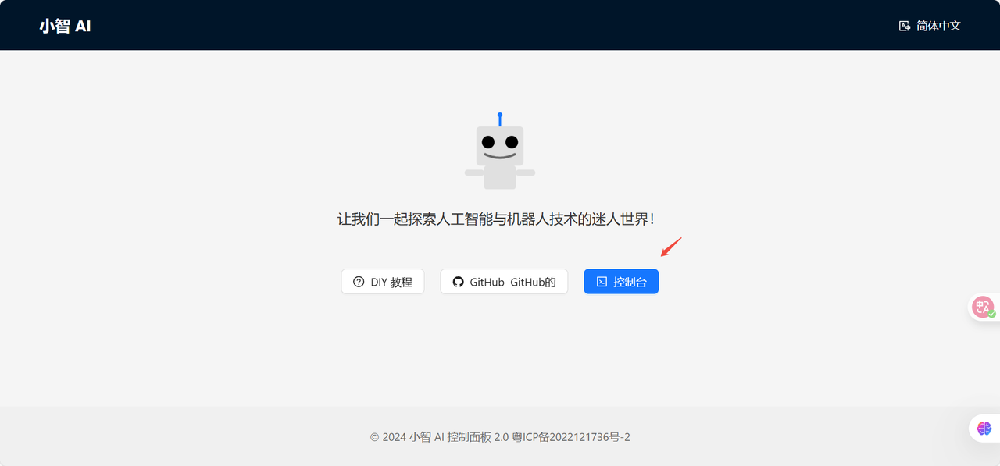
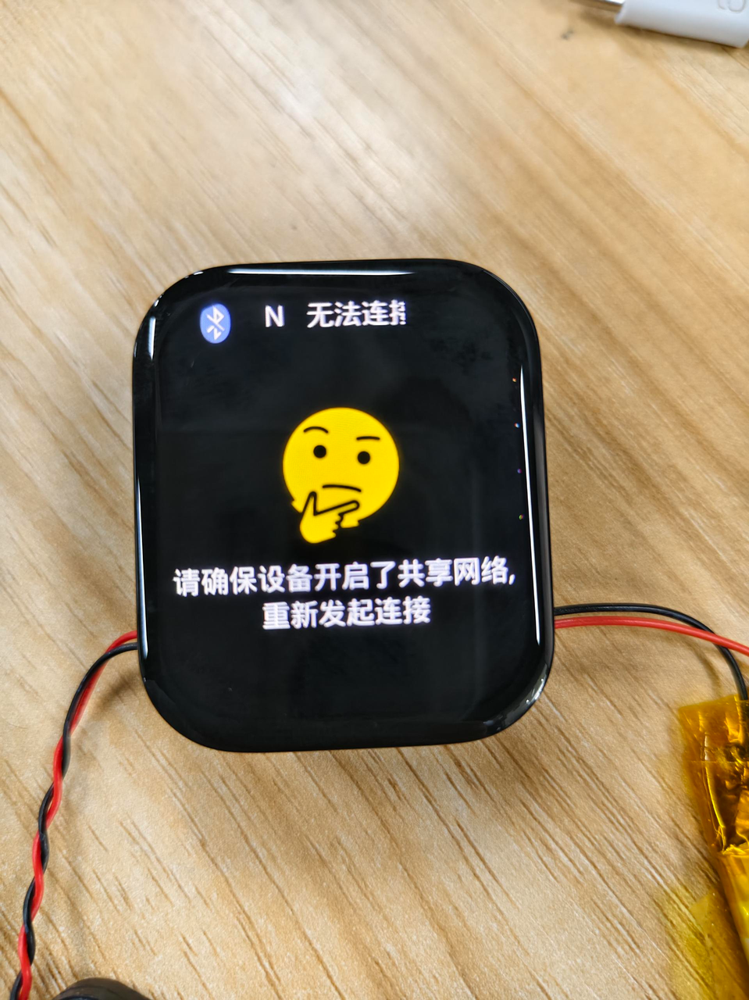
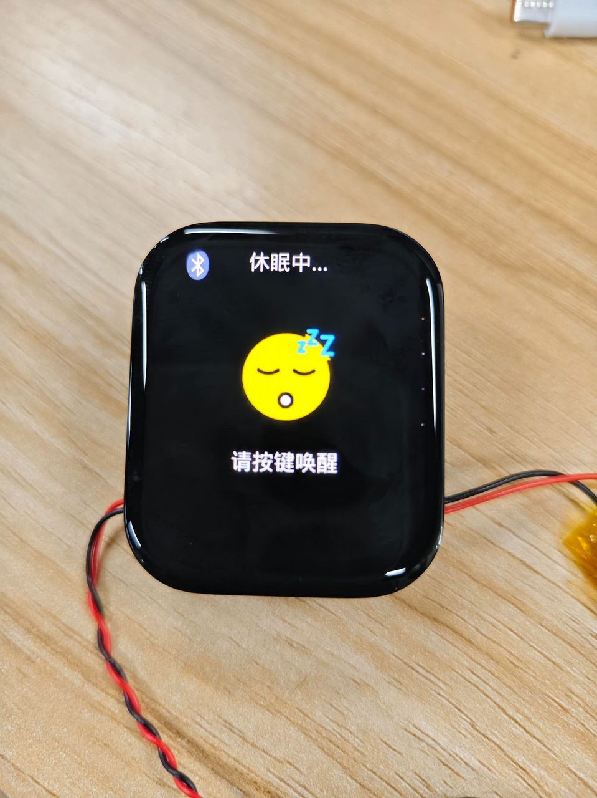

本文档将介绍如何在黄山派上快速入门。


## 前置准备

在开始之前，我们需要一些前置工作，例如安装[sftool工具](../sftool.md)。

## 固件地址

黄山派板子的固件位于 <https://github.com/78/xiaozhi-sf32/releases>，我们下载最新版本。需要注意的是，我们一共需要下载`bootloader.bin`、`ftab.bin`、和`main.bin`这三个文件。

## 硬件

### 1. 短接引脚

首先需要短接开发板的三对引脚，如图，这三对引脚是用来测量功耗的跳线，正常使用时需要将其短接。


### 2. 连接喇叭

应该将喇叭连接到开发板的`SPK`接口上，黄山派支持8Ω和4Ω的喇叭，建议使用4Ω的喇叭，音量更大。

## 烧录固件

使用[sftool工具](../sftool.md)烧录固件，打开终端之后输入如下命令：

```powershell
sftool.exe -p COM3 -c SF32LB52 write_flash bootloader.bin@0x12010000 main.bin@0x12020000 ftab.bin@0x12000000
```

::: tip

其中`COM3`是你连接黄山派的串口号，可能会有所不同，请根据实际情况修改。`bootloader.bin`、`main.bin`、和`ftab.bin`是你下载的固件文件名，建议使用绝对路径引用，如果路径中出现中文或者空格请用`"`将路径括起来。

:::

没有意外的话，烧录完成之后会自动重启运行，屏幕应该被点亮。

## 蓝牙使用注意事项

在连接板子设备之前，请打开手机的蓝牙网络共享功能！！！

### Android蓝牙使用注意事项

以下是Android手机的蓝牙设置界面，通过打开个人热点共享中的蓝牙共享网络功能。


### iOS蓝牙使用注意事项

iOS同样需要打开蓝牙共享网络功能，以下是参考步骤




⚠ 注意 如果iOS在蓝牙列表未看见sifli-pan 设备，请尝试重启手机。

## 开始使用

正确烧录固件后，开发板初始化界面如下:


### 激活设备

烧录固件之后，确保蓝牙共享网络已打开，这时，手机就可以连接蓝牙 sifli-pan 设备了。 以下是Android手机连接状态示例图: 


⚠ 注意：一般情况下，Android连接成功后，连接的蓝牙设备会显示正在向设备共享网络（iOS不会显示）,我们可以以此确定是否成功开启蓝牙网络共享

连接上sifli-pan设备后，开发板会有连接画面提示，此时按下对话按键(KEY2)，xiaozhi则会提示需要登录到控制面板，填设备码。





这个时候，打开浏览器，输入网址：<https://xiaozhi.me>。浏览器用手机或者电脑都可以。 进入小智 AI 的网页后，点击控制台，用手机号登录。

新建智能体填写，最后添加设备码。

可以这个时候拔掉开发板上的数据线再接入就可以正常使用了。




## 界面提示含义
### 出现下方UI提示均是pan断开的情况




异常情况：
1. 对应手机的显示可能是未打开蓝牙共享直接连接sifli-pan设备
2. 蓝牙共享网络关闭
3. 蓝牙已断开

解决方案：打开蓝牙共享网络重新连接设备

下图为蓝牙连接成功但未开启蓝牙共享网络：


## 唤醒 & 重连

### 唤醒

长时间未对话小智会进入休眠，此时需要按下`KEY1`进行唤醒



### 重连

支持重连操作：若无主动删除手机匹配列表下的sifli-pan设备，当按下`KEY1`也可进行蓝牙重连


