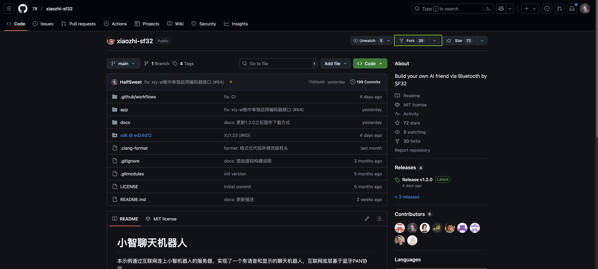
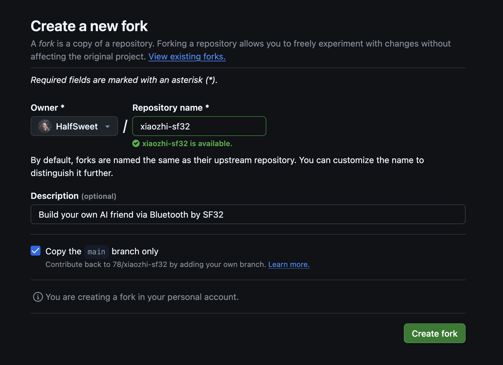
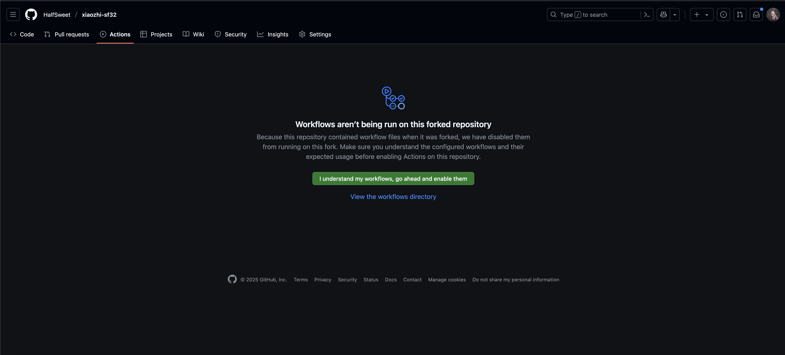
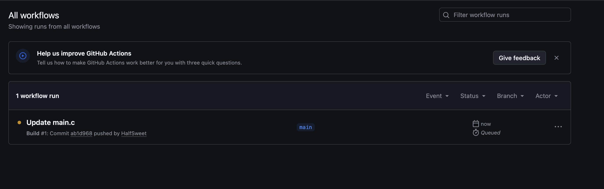
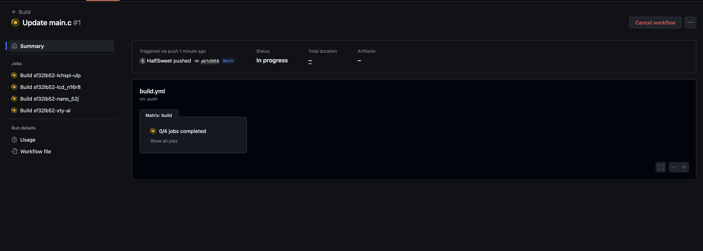
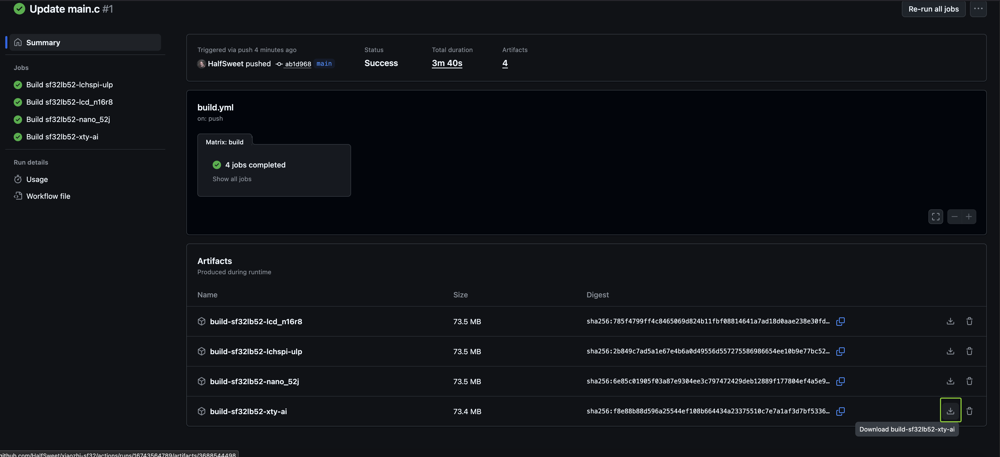

## 概述

经过了前面快速入门的学习，我们已经成功下了预编译的固件进行使用。但是我们可能有一些定制化的需求，比如修改蓝牙连接的名称，或者是想换一个屏幕，这就需要修改源码并重新编译了。在这一章节中，我们将学会如何自己编译固件。

## 硬件支持

目前我们支持的硬件有：

- [SF32LB52-DevKit-ULP（黄山派）](SF32LB52-DevKit-ULP/README.md)
- [SF32LB52-DevKit-LCD开发板](SF32LB52-DevKit-LCD/README.md)
- [SF32LB52-DevKit-Nano开发板](SF32LB52-DevKit-Nano/README.md)

## 使用 GitHub Action 自动编译（可选）

在Windows上进行小智的编译会比较耗时，而在Linux和macOS上相对会快一些。但考虑到Linux的使用门槛相对较高，我们可以利用GitHub Action来实现自动化编译，这能为您节省不少本地编译时间。

### 前置条件

在开始之前，请确保您已具备以下条件：

- 拥有一个GitHub账号
- 掌握基础的git知识，了解`pull`、`push`等操作的含义

### 操作步骤

#### 一. Fork仓库

首先需要将原始仓库fork到您自己的GitHub账号下：

1. 访问项目的GitHub页面，点击页面右上角的**Fork**按钮

   

2. 在弹出的对话框中点击**Create fork**，系统会自动将原始仓库复制到您的账号下

   

#### 二. 开启 GitHub Action 权限

完成fork后，进入您fork的仓库：

1. 点击仓库页面的**Actions**选项卡
2. 如果看到需要启用Actions的提示页面，点击绿色的启用按钮即可

   

#### 三. 克隆仓库并修改代码

将您fork的仓库克隆到本地进行开发：

```bash
# 将下面的链接替换为您自己fork的仓库地址
git clone https://github.com/YOUR_USERNAME/xiaozhi-sf32.git
```

> 📝 **提示**：具体的clone和编译步骤可以参考[使用脚本编译 | 小智百科全书](https://docs.sifli.com/projects/xiaozhi/source-build/SF32LB52-DevKit-ULP/script.html)

如果您之前已经clone过原始仓库，可以通过以下方式添加您fork的仓库：

```bash
git remote add origin https://github.com/YOUR_USERNAME/xiaozhi-sf32.git
```

使用您喜欢的编辑器（如VSCode）打开项目，进行代码修改。完成修改后：

```bash
git add .
git commit -m "您的修改说明"
git push origin main
```

#### 四. 查看编译结果

代码推送后，GitHub Action会自动开始编译：

1. 返回您fork仓库的**Actions**页面
2. 刷新页面后可以看到刚才推送的commit已开始编译

   

3. 编译过程中会显示黄色的进行中状态，您可以点击进入查看详细的编译步骤

   

4. 编译通常需要3-5分钟完成

#### 五. 下载编译产物

编译完成后：

1. 再次刷新Actions页面
2. 在完成的构建任务下方会出现**Artifacts**栏
3. 点击对应芯片的下载按钮即可获取构建产物

   

4. 编译完成之后再次刷新页面，可以看到下方多了几个Artifacts栏，点击下载按钮即可下载对应芯片的构建产物，可直接烧录。

