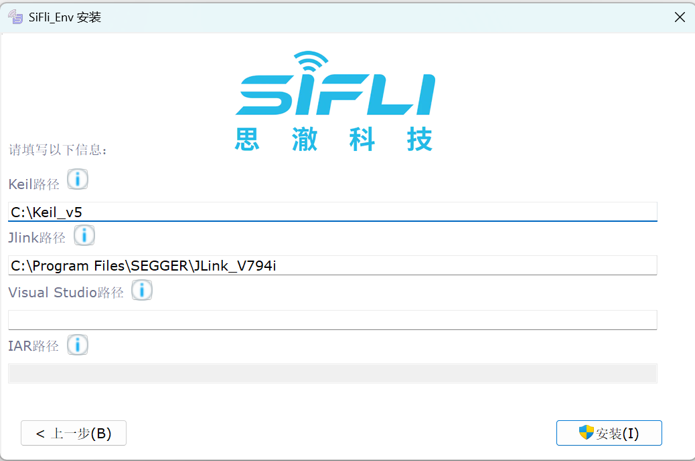
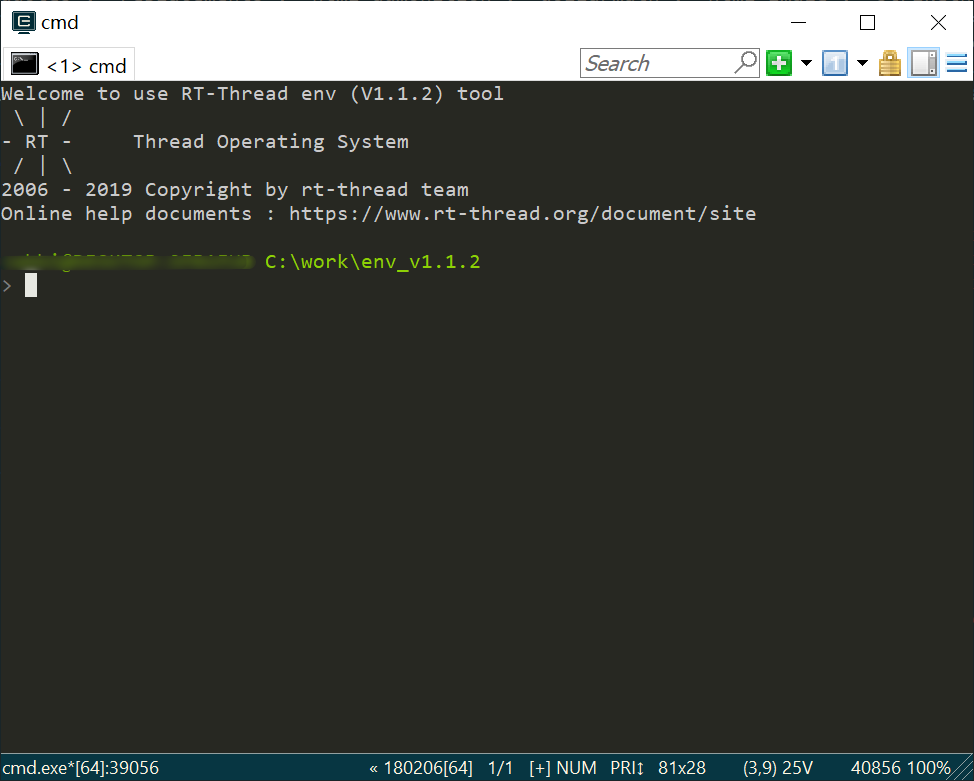

xiaozhi-sf32 项目支持使用两种方式进行编译，一种是使用 `SiFli-ENV`，另一种则是使用 SDK 内置的工具链进行。一般来说没有特别的说明下每种开发板变体均支持这两种方式，除非有特殊指定。

## SiFli-ENV

SiFli-ENV 基于 RT-Thread ENV 修改，适合SiFli-SDK。目前最新版的下载链接为：<https://downloads.sifli.com/sdk/env_1.1.1.zip>

下载完成后双击运行安装程序，按提示完成安装，下图中的路径填写本机已安装的Keil、JLink、Visual Studio等软件的路径，将鼠标移动到i图标上可以查看提示，如果未安装相应软件，可以不填写。

安装完成后，在任意目录点击鼠标右键打开快捷菜单，将看到如图新增的`ConEmu Here`菜单

点击`ConEmu Here`菜单启动Env命令行窗口，命令行所在的目录为点击右键菜单所在的目录，显示下图窗口即表示Env命令行已正常打开，后续的应用配置、编译和烧写都将在该命令行窗口下完成。

::: note

SiFli Env命令行窗口类似Windows的命令行，可以执行常用的Windows命令。

:::